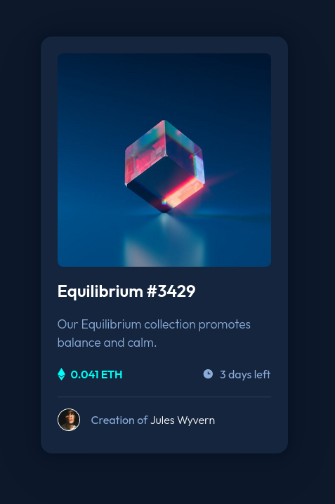

# Frontend Mentor - NFT preview card component solution

This is a solution to the [NFT preview card component challenge on Frontend Mentor](https://www.frontendmentor.io/challenges/nft-preview-card-component-SbdUL_w0U). Frontend Mentor challenges help you improve your coding skills by building realistic projects.

## Table of contents

- [Overview](#overview)
  - [The challenge](#the-challenge)
  - [Screenshot](#screenshot)
  - [Links](#links)
- [My process](#my-process)
  - [Built with](#built-with)
  - [What I learned](#what-i-learned)

## Overview

### The challenge

Users should be able to:

- View the optimal layout depending on their device's screen size
- See hover states for interactive elements

### Screenshot



### Links

- Solution URL: [Add solution URL here](https://github.com/kawsarahmed-012/nft-preview-card-component)
- Live Site URL: [Add live site URL here](https://nft-preview-card-component-kawsar.netlify.app)

## My process

### Built with

- Semantic HTML5 markup
- CSS custom properties
- Flexbox
- CSS Grid
- Position absolute
- Mobile-first workflow
- [React](https://reactjs.org/) - JS library
- BEM

### What I learned

Images are inline element, so they follows text rules. The line height property is creating some empty space below the image in the following markup.


```html
<div className="card__header">
  <div className="card__header-overlay">
    
  </div>
  
</div>
```

To remove this add any of these css.

- ```css
  .card__header {
    line-height: 0;
  }
  ```
- ```css
  img {
    display: block;
  }
  ```

- ```css
  img {
    vertical-align: bottom;
  }
  ```
